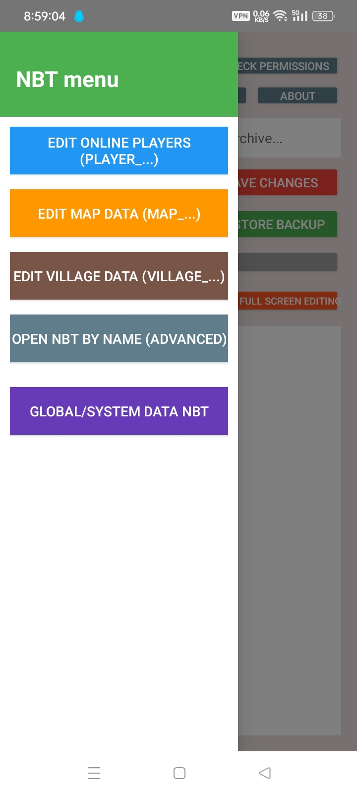

<h1 align="center">yhjmew NBT editor</h1>

<!-- SHIELD GROUP -->
[![Version][version-shield]][version-link]
[![License][license-shield]][license-link]
[![Issues][issues-shield]][issues-link]

[![Forks][forks-shield]][forks-link]
[![Stars][stars-shield]][stars-link]
[![Contributors][contributors-shield]][contributors-link]

<!-- 社交与外部链接 -->
[![Bilibili][bilibili-shield]][bilibili-link]
[![QQ Group][qq-shield]][qq-link]
[![Telegram][tg-shield]][tg-link]

English · [Chinese](./README.zh-CN.md) · [Change log](./CHANGELOG.md)

 

> [!WARNING]
> I know there will be problems, but I still have to apologize 
> This application is only available in[AIDE+](https://github.com/AndroidIDE-CN/AIDE-Plus)Runthrough can be built on 
> **This application code is 100% written by Gemini 3 Pro preview** 
> **You may see a large number of comments (even historical comments) and incorrect formatting in Java xml, etc.** 

> [!TIP]
> Do you want to participate in this, add application functions, modify functions, etc. 
> Please fork and submit a PR, or patch and tidy it up yourself after forking. If there are major changes to the existing code, **PR is not recommended.**

<kbd>Table of contents</kbd>

#### directory listing

- [🌸 Project Introduction](#-Project-Introduction)
- [🖼️ App Screenshot](#-App-Screenshot)
- [🚀 Get started quickly](#-Get-started-quickly)
- [📄 Update Log](#-Update-Log)
- [👥 Thank you list](#-Thank-you-list)
- [📜 Open source agreement](#-Open-source-agreement)

 

## 🌸 Project introduction
The imitation Blocktopograph is not directly adapted from him.
Just like a tire, a similar

## 🖼️ App screenshots

<kbd>🌸 View app interface preview</kbd>

   
  <!-- 这里直接引用底部的链接名是不行的，必须写路径或者直接用引用式 -->
  <!-- 建议如果需要限宽，直接在 details 里用 img 标签 -->
  
   
  
   
  
   
  
   
  
   
  
   
  
   
  
   
  
   
  
   
  
   
  
   
  
   
  
   
  
   
  
   

## 🚀 Get started quickly
### 📺 Introduction to use

Introduction and usage tutorial：

图文会在24号之前赶出来

> [!TIP]
> Make sure you **have the basics[Shizuku](https://github.com/RikkaApps/Shizuku)use**, the app will ask for 
> Otherwise, you will be **unable to access Android/data** Minecraft files. 
> **Currently only supports Android 9 ~ 13** 
> Obtaining all file permissions is for the download directory to read and write to the old directory and the private directory.

## 📄 Change log

<kbd>Update catalog</kbd>

- [x] based on existing Blocktopograph 1.9.4 rbq2012.blocktopograph
- [ ] The map is not implemented yet
- [ ] ~~old No Shizuku version~~ Unified and merged into one version

Other ideas and modifications are still being implemented

## 👥 Thank you list
 [@Yejdhi](https://github.com/Yejdhi) Provided me with many methods and modification ideas 
 [@LeviMC](https://github.com/LiteLDev) Provided me with methods and ideas for modifications 
(It is also recommended to take a look at LeviMC’s open source projects)

## 📜 Open source agreement

This project uses **[CC BY-NC-SA 4.0](https://creativecommons.org/licenses/by-nc-sa/4.0/deed.en)** protocol

<!-- 这里是底部的链接定义-->

[version-shield]: https://img.shields.io/badge/Version-v1.0.3-369eff?style=flat-square&labelColor=black
[version-link]: https://github.com/yinghuajimew/yhjmew.minecraft.nbteditor/releases

[issues-shield]: https://img.shields.io/github/issues/yinghuajimew/yhjmew.minecraft.nbteditor?color=ff80eb&labelColor=black&style=flat-square
[issues-link]: https://github.com/yinghuajimew/yhjmew.minecraft.nbteditor/issues

[forks-shield]: https://img.shields.io/github/forks/yinghuajimew/yhjmew.minecraft.nbteditor?color=8ae8ff&labelColor=black&style=flat-square
[forks-link]: https://github.com/yinghuajimew/yhjmew.minecraft.nbteditor/network/members

[stars-shield]: https://img.shields.io/github/stars/yinghuajimew/yhjmew.minecraft.nbteditor?color=ffcb47&labelColor=black&style=flat-square
[stars-link]: https://github.com/yinghuajimew/yhjmew.minecraft.nbteditor/stargazers

[contributors-shield]: https://img.shields.io/github/contributors/yinghuajimew/yhjmew.minecraft.nbteditor?color=c4f042&labelColor=black&style=flat-square
[contributors-link]: https://github.com/yinghuajimew/yhjmew.minecraft.nbteditor/graphs/contributors

[license-shield]: https://img.shields.io/badge/license-CC_BY--NC--SA_4.0-orange?style=flat-square&labelColor=black
[license-link]: https://creativecommons.org/licenses/by-nc-sa/4.0/deed.en

<!-- 社交链接定义 -->

<!-- Bilibili: 少女粉 #FB7299 -->
[bilibili-shield]: https://img.shields.io/badge/Bilibili-FB7299?style=flat-square&labelColor=black&logo=bilibili&logoColor=white
[bilibili-link]: https://www.bilibili.com/video/BV16dfnBrEzT

<!-- QQ交流群: 腾讯蓝 #12B7F5 -->
[qq-shield]: https://img.shields.io/badge/QQ_group-12B7F5?style=flat-square&labelColor=black&logo=qq&logoColor=white
[qq-link]: https://qm.qq.com/cgi-bin/qm/qr?_wv=1027&group_code=1077349003

<!-- Telegram频道: 电报蓝 #26A5E4 -->
[tg-shield]: https://img.shields.io/badge/Telegram-26A5E4?style=flat-square&labelColor=black&logo=telegram&logoColor=white
[tg-link]: https://t.me/yhjmew_minecraft_nbteditor