

<h1 align="center">樱花祭喵 NBT编辑器</h1>

<!-- SHIELD GROUP -->
[![Version][version-shield]][version-link]
[![License][license-shield]][license-link]
[![Issues][issues-shield]][issues-link]

[![Forks][forks-shield]][forks-link]
[![Stars][stars-shield]][stars-link]
[![Contributors][contributors-shield]][contributors-link]

<!-- 社交与外部链接 -->
[![Bilibili][bilibili-shield]][bilibili-link]
[![QQ Group][qq-shield]][qq-link]
[![Telegram][tg-shield]][tg-link]

[English](./README.md) · 中文 · [变更日志](./CHANGELOG.md)

 

> [!WARNING]
> 我知道会有问题，但是我还得道歉 
> 这个应用只有在[AIDE+](https://github.com/AndroidIDE-CN/AIDE-Plus)上可构建跑通 
> **此应用代码100%均由Gemini 3 Pro preview 编写** 
> **您在 Java xml 等当中，可能会看见大量注释(甚至是历史遗留注释)和未进行正确格式化** 

> [!TIP]
> 您想要参与到此，应用功能添加，功能修改等 
> 请fork并提交pr，或者fork后自己修补并整理，如与现有代码发生很大变动，**不建议pr**

<kbd>目录</kbd>

#### 目录列表

- [🌸 项目简介](#-项目简介)
- [🖼️ 应用截图](#-应用截图)
- [🚀 快速上手](#-快速上手)
- [📄 更新日志](#-更新日志)
- [👥 感谢列表](#-感谢列表)

 

## 🌸 项目简介
仿造Blocktopograph，并没有直接从他而改来的
就像轮胎一样，仿造了一个类似

## 🖼️ 应用截图

<kbd>🌸 查看应用界面预览</kbd>

   
  <!-- 这里直接引用底部的链接名是不行的，必须写路径或者直接用引用式 -->
  <!-- 建议如果需要限宽，直接在 details 里用 img 标签 -->
  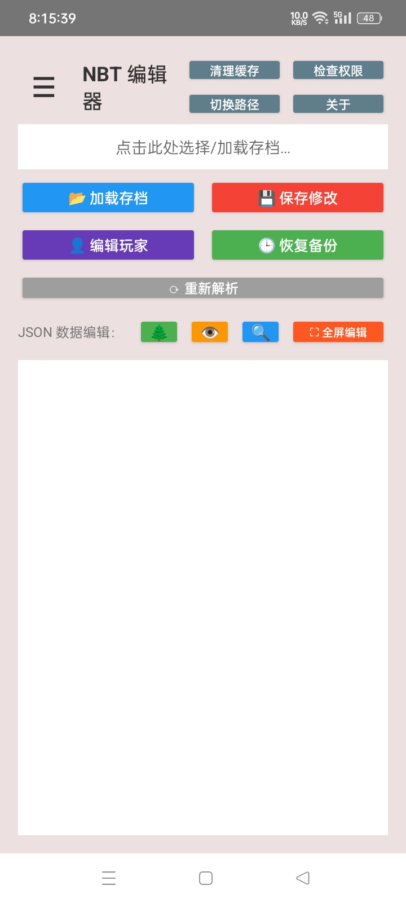
   
  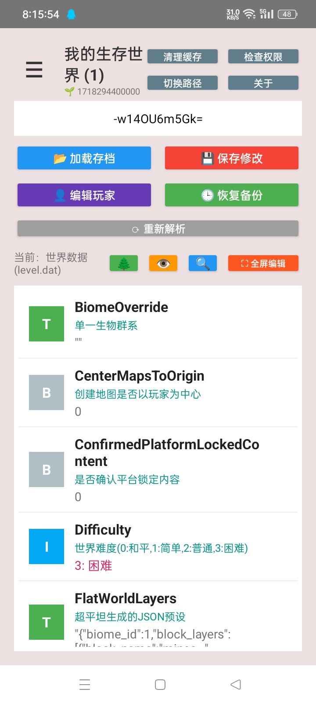
   
  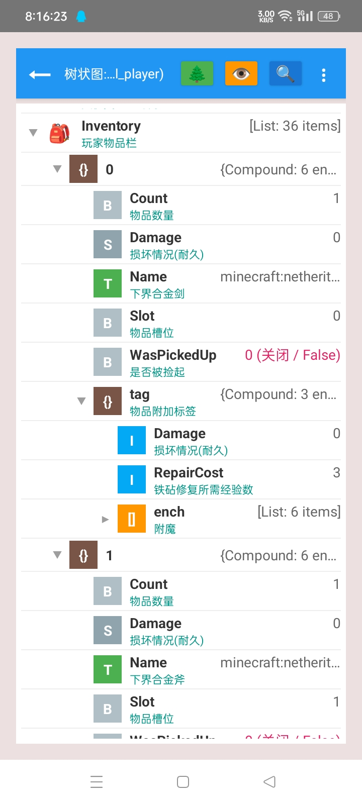
   
  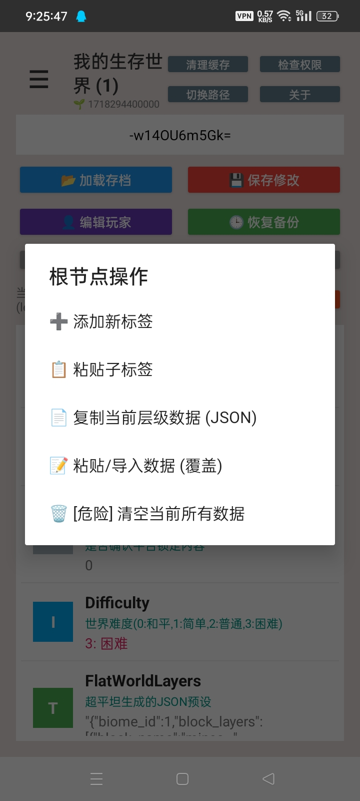
   
  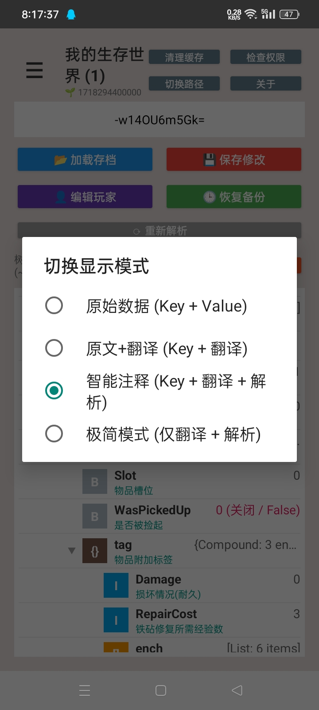
   
  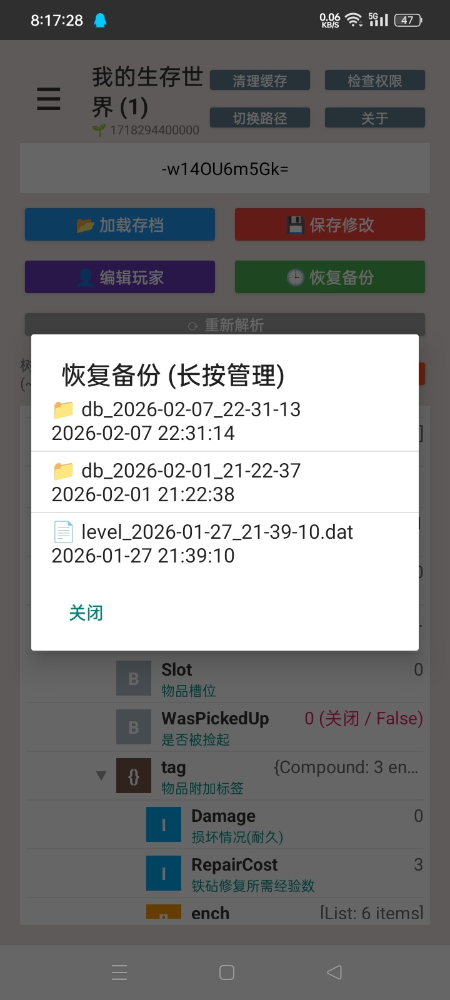
   
  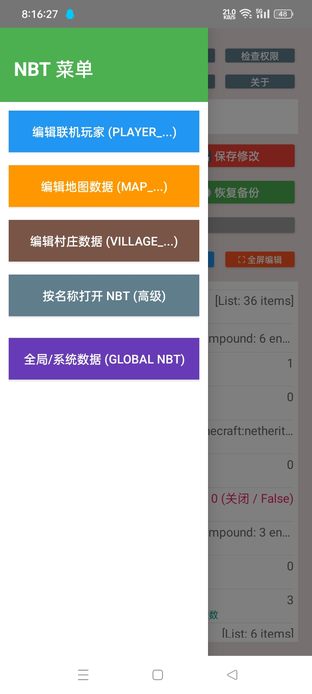
   
  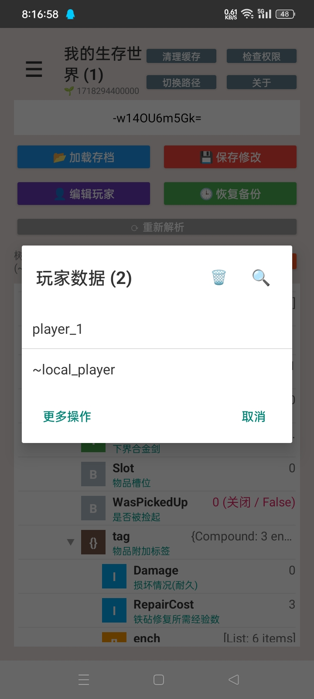
   
  
   
  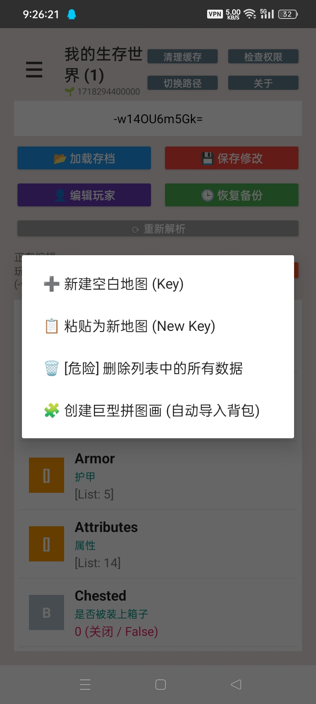
   
  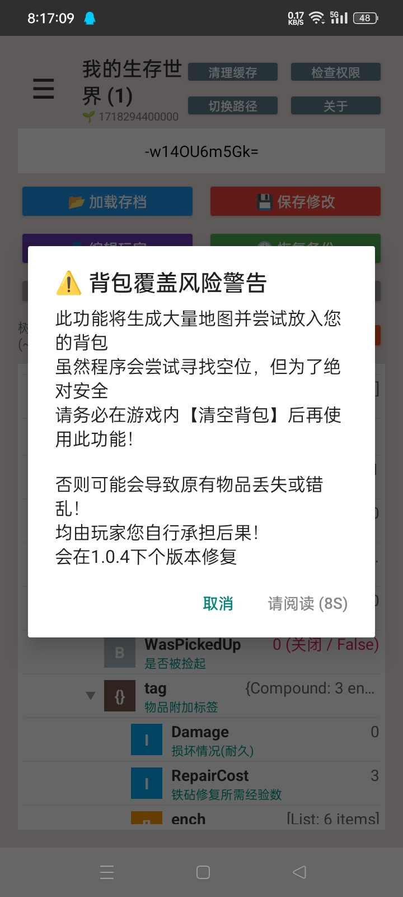
   
  
   
  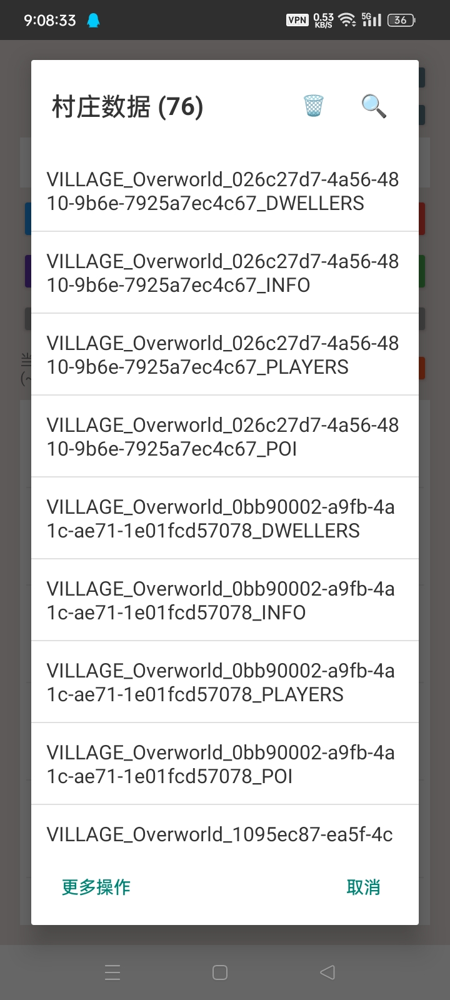
   
  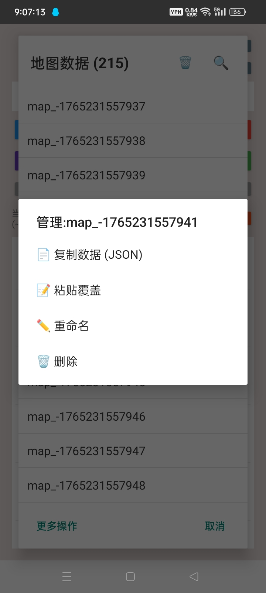
   
  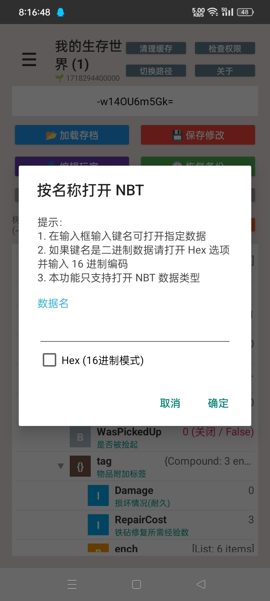
   
  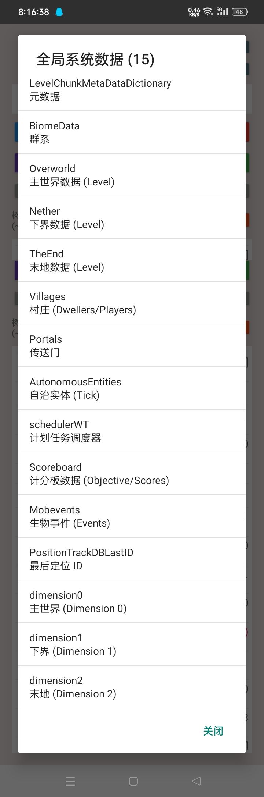
   

## 🚀 快速上手
可能还需要一段时间(3~5天)，等我写完

> [!TIP]
> 确保您**具有基础[Shizuku](https://github.com/RikkaApps/Shizuku)使用**，此应用会在启动时索要 
> 否则会**无法访问Android/data** Minecraft 文件 
> **目前仅支持Android 9 ~ 13** 
> 获取所有文件权限是为了，下载目录与旧目录读写和私有目录往返

## 📄 更新日志

<kbd>更新目录</kbd>

- [x] 根据现有的Blocktopograph 1.9.4 rbq2012.blocktopograph
- [ ] 地图暂时未实现
- [ ] old 无Shizuku版本

其他想法和修改还在实现中

## 👥 感谢列表
 [@Yejdhi](https://space.bilibili.com/628906424) 给我提供了许多方法和修改的点子 
 [@LeviMC](https://github.com/LiteLDev) 给我提供了方法和修改的点子 
(也推荐看看LeviMC他们的开源项目)

<!-- 这里是底部的链接定义-->

[version-shield]: https://img.shields.io/badge/版本-v1.0.3-369eff?style=flat-square&labelColor=black
[version-link]: https://github.com/yinghuajimew/yhjmew.minecraft.nbteditor/releases

[issues-shield]: https://img.shields.io/github/issues/yinghuajimew/yhjmew.minecraft.nbteditor?color=ff80eb&labelColor=black&style=flat-square
[issues-link]: https://github.com/yinghuajimew/yhjmew.minecraft.nbteditor/issues

[forks-shield]: https://img.shields.io/github/forks/yinghuajimew/yhjmew.minecraft.nbteditor?color=8ae8ff&labelColor=black&style=flat-square
[forks-link]: https://github.com/yinghuajimew/yhjmew.minecraft.nbteditor/network/members

[stars-shield]: https://img.shields.io/github/stars/yinghuajimew/yhjmew.minecraft.nbteditor?color=ffcb47&labelColor=black&style=flat-square
[stars-link]: https://github.com/yinghuajimew/yhjmew.minecraft.nbteditor/stargazers

[contributors-shield]: https://img.shields.io/github/contributors/yinghuajimew/yhjmew.minecraft.nbteditor?color=c4f042&labelColor=black&style=flat-square
[contributors-link]: https://github.com/yinghuajimew/yhjmew.minecraft.nbteditor/graphs/contributors

[license-shield]: https://img.shields.io/badge/license-CC_BY--NC--SA_4.0-orange?style=flat-square&labelColor=black
[license-link]: https://creativecommons.org/licenses/by-nc-sa/4.0/deed.zh-hans

<!-- 社交链接定义 -->

<!-- Bilibili: 少女粉 #FB7299 -->
[bilibili-shield]: https://img.shields.io/badge/Bilibili-制作中-FB7299?style=flat-square&labelColor=black&logo=bilibili&logoColor=white
[bilibili-link]: https://space.bilibili.com/648037057

<!-- QQ交流群: 腾讯蓝 #12B7F5 -->
[qq-shield]: https://img.shields.io/badge/QQ交流群-12B7F5?style=flat-square&labelColor=black&logo=qq&logoColor=white
[qq-link]: https://qm.qq.com/cgi-bin/qm/qr?_wv=1027&group_code=1077349003

<!-- Telegram频道: 电报蓝 #26A5E4 -->
[tg-shield]: https://img.shields.io/badge/Telegram频道-26A5E4?style=flat-square&labelColor=black&logo=telegram&logoColor=white
[tg-link]: https://t.me/yhjmew_minecraft_nbteditor